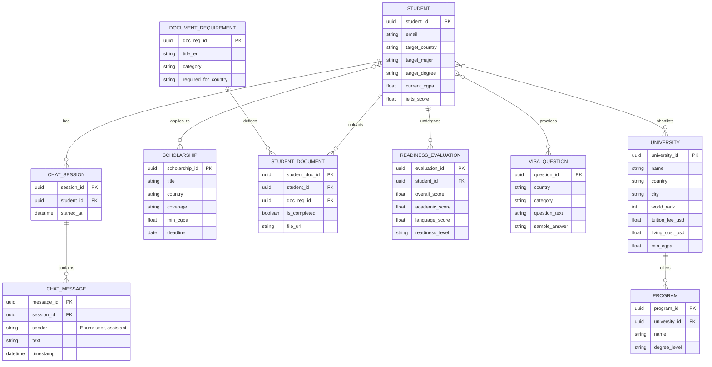

# ScholarPath AI - Entity Relationship Diagram

This ER Diagram is based on the data structures defined in `src/types.ts` of the ScholarPath AI project. It models the core entities needed to support the features like University search, Scholarship finder, Readiness Assessment, Visa preparation, and AI Chat.

## Entity Breakdown (10 Entities)

1. **STUDENT**: Represents the user profile derived from the inputs required for `ApplicationReadinessRequest`.
2. **UNIVERSITY**: Represents the institutional data mapped directly from the `University` interface.
3. **PROGRAM**: Normalized from the `programs: string[]` array inside the University interface to properly represent a relational structure.
4. **SCHOLARSHIP**: Maps to the `Scholarship` interface, capturing funding opportunities.
5. **DOCUMENT_REQUIREMENT**: Maps to the `DocumentCheckitem` interface, representing the system's global document rules per country.
6. **STUDENT_DOCUMENT**: The junction entity linking a specific student to a requirement, tracking their `isCompleted` status.
7. **READINESS_EVALUATION**: Maps to the `ApplicationReadinessResponse` storing the computed scores (academic, language, sop, etc.) for a student.
8. **VISA_QUESTION**: Maps to the `VisaInterviewQuestion` interface, holding practice questions and tips.
9. **CHAT_SESSION**: Logical container for an AI chat conversation for a specific student.
10. **CHAT_MESSAGE**: Maps to the `ChatMessage` interface, tracking individual AI and user responses with timestamps.
